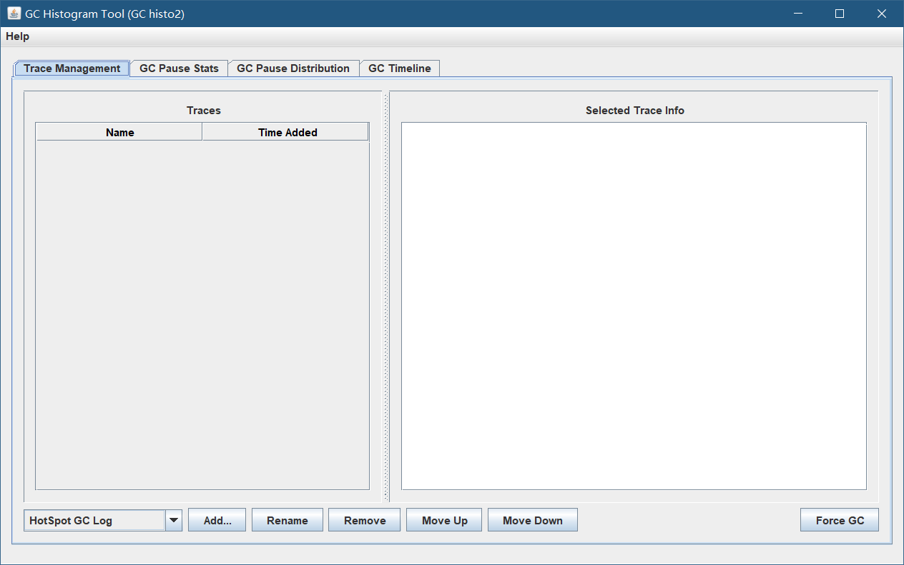
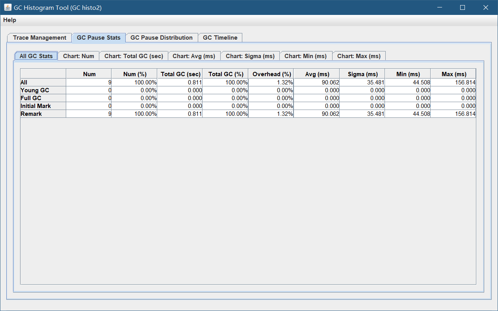

# 1. 概述
用于分析gc日志的一款强大工具，基于JDK8。 
- 一个用于分析GC日志的工具，发展起源于[gchisto](https://github.com/wengyingjian/gchisto.git) ，向原作者表示敬意。
- 原库已停更超过5年时间，我继续在这里维护。
- 本软件完全开源免费，请放心使用，版权无限。

# 2. 功能速览
## 首页


## 分析结果


## 图表
原来的图表在新的JDK和高清屏下有些问题，我回头更新版本完善了再发图

# 3. 使用方法
通常，我们会在自己的项目启动的命令行上加上这样的选项：
```shell
JAVA_OPTS="-XX:NewSize=512m -XX:MaxNewSize=1024m -Xms512m -Xmx2048m -XX:MetaspaceSize=1024m -XX:MaxMetaspaceSize=2048m -XX:+UseConcMarkSweepGC -XX:+UseParNewGC -XX:+CMSParallelRemarkEnabled -XX:+UseCMSCompactAtFullCollection -XX:CMSFullGCsBeforeCompaction=0 -XX:+CMSClassUnloadingEnabled -XX:+UseFastAccessorMethods -XX:+PrintGCDetails -XX:+PrintGCTimeStamps -XX:+PrintHeapAtGC -Xloggc:/logs/app/gc.log"
```
于是，我们就有了gc.log这个文件，系统运行一段时间后（如果你的系统运行很平稳，一两天也没事，如果你的系统病入膏肓，那就半个一个小时吧），把gc.log下载下来，使用本工具加载打开即可。
